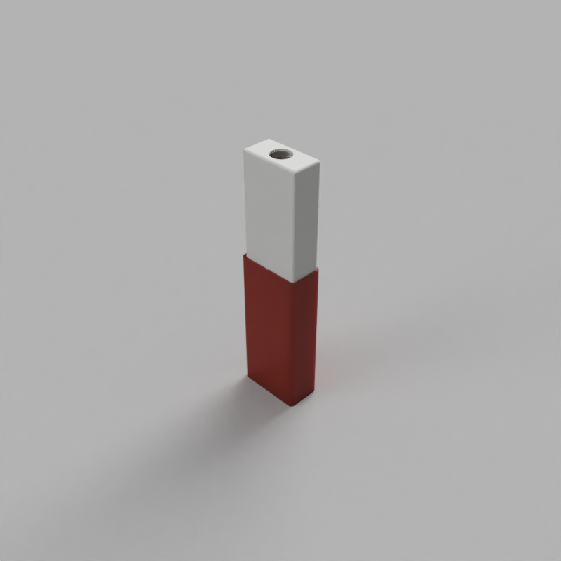
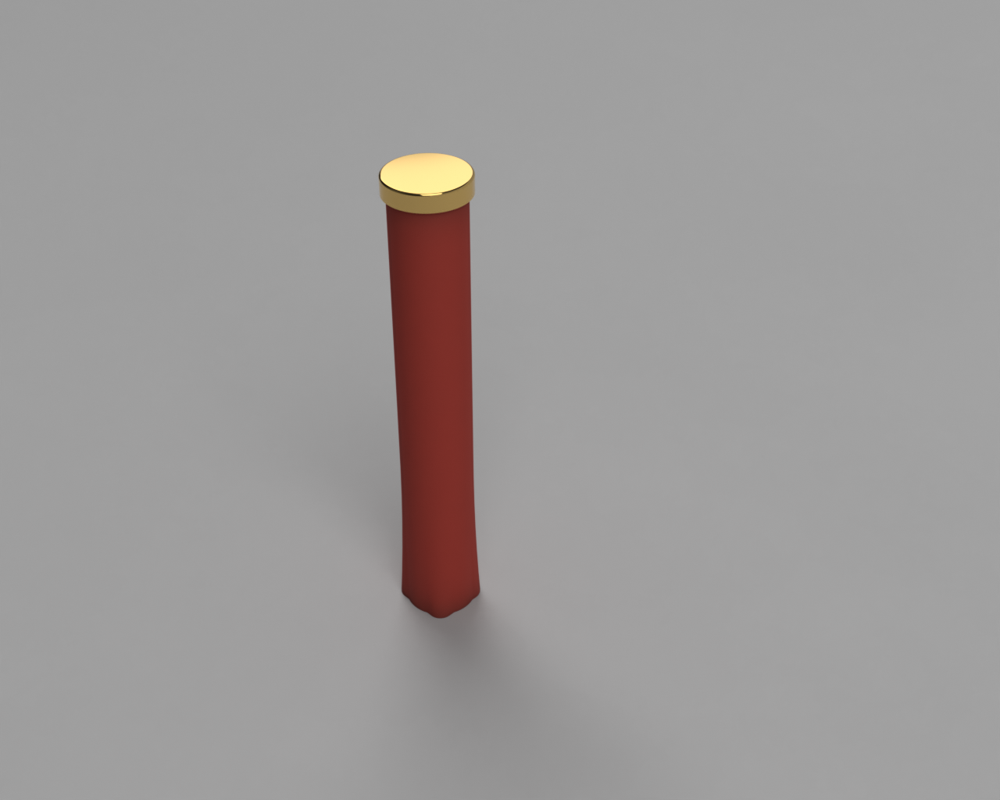

# Toothbrush case

There two brush cases to choose from. The rectangular case is a friction fit
with two halves.

# Single brush case

The single brush case fits one brush and screws on with a cap.

# Notes

Wrap toothbrushes in something like a zip top/lock bag before storing them in
these. 3D printers and prints aren't known for their cleanliness.

# License

CC0 1.0 Universal
